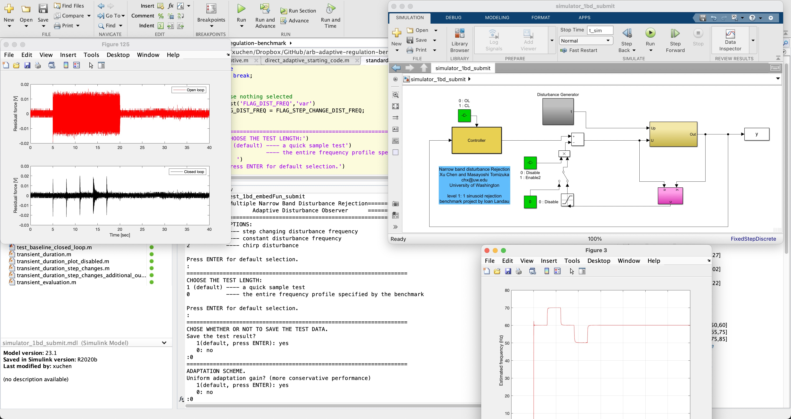

# MACS Adaptive Regulation Benchmark (MACS ARB)

<https://github.com/macs-lab/macs-arb-adaptive-regulation-benchmark>

The MACS ARB is a top-tier algorithm in the 2012-2013 [*International Benchmark on Adaptive Regulation*](http://dx.doi.org/10.1016/j.ejcon.2013.05.007) by Ioan D. Landau. The benchmark provided state-of-the-art evaluation and dissemination of adaptation methods for active vibration control and noise control.

Algorithmically, MACS ARB presents an adaptive control scheme for identifying and rejecting unknown and/or time-varying narrow-band vibrations. We discuss an idea of safely and adaptively inverting a (possibly non-minimum phase) plant dynamics at selected frequency regions, so that structured disturbances (especially vibrations) can be estimated and canceled from the control perspective. By taking advantage of the disturbance model in the design of special infinite-impulse-response (IIR) filters, we can reduce the adaptation to identify the minimum amount of parameters, achieve accurate parameter estimation under noisy environments, and flexibly reject the narrow-band disturbances with clear tuning intuitions.

See details in: 
- [Chen, X.; and Tomizuka, M. Selective Model Inversion and Adaptive Disturbance Observer for Time-varying Vibration Rejection on an Active-suspension Benchmark. European Journal of Control, 19(4): 300 - 312. 2013.](https://www.researchgate.net/publication/259137172_Selective_model_inversion_and_adaptive_disturbance_observer_for_rejection_of_time-varying_vibrations_on_an_active_suspension), and
- [Chen, X.; and Tomizuka, M. Overview and new results in disturbance observer based adaptive vibration rejection with application to advanced manufacturing, International Journal of Adaptive Control and Signal Processing, 29:1459-1474 2015.](https://www.researchgate.net/publication/272754396_Overview_and_new_results_in_disturbance_observer_based_adaptive_vibration_rejection_with_application_to_advanced_manufacturing) 

## Running the Code

Run standard_test_embedFun_submit.m and configure different options from the command prompt.
- The default code will run adaptive control against disturbances with a sudden frequency change. You will be prompted to test other aggressive disturbances such as vibrations with multiple jump changes of frequencies, and a chirp disturbance, namely, a disturbance that linearly changes its frequency between different set points. 
- The controller contains a baseline feedback controller and an adaptive disturbance observer that includes a copy of the plant model, a nominal inverse of the plant, a model-based Q filter design, and different parameter adaptation algorithms (PAAs).
- Read the Simulink block diagram “simulator_1bd_submit.mdl”. Double-click the yellow block not marked as “Controller”. Then double-click the red block titled “SAAI” to understand the different signal paths.
- The PAA is implemented in a Matlab-embedded function. Open the Simulink file “simulator_1bd_submit.mdl”. Double-click the magenta disturbance observer block. Then double-click the orange PAA block titled “dist. ID”. Observe the different inputs and outputs of the Embedded MATLAB Function block titled “PAA” in the center of the block. 

## Looking for More Challenges?

[Level 2 of the adaptive regulation benchmark](https://github.com/macs-lab/arb-adaptive-regulation-benchmark-lv2-training) provides a codebase for fast adaptative regulation of multiple unknown, time-varying disturbances. Test your understanding and coding skills by completing the codebase!
